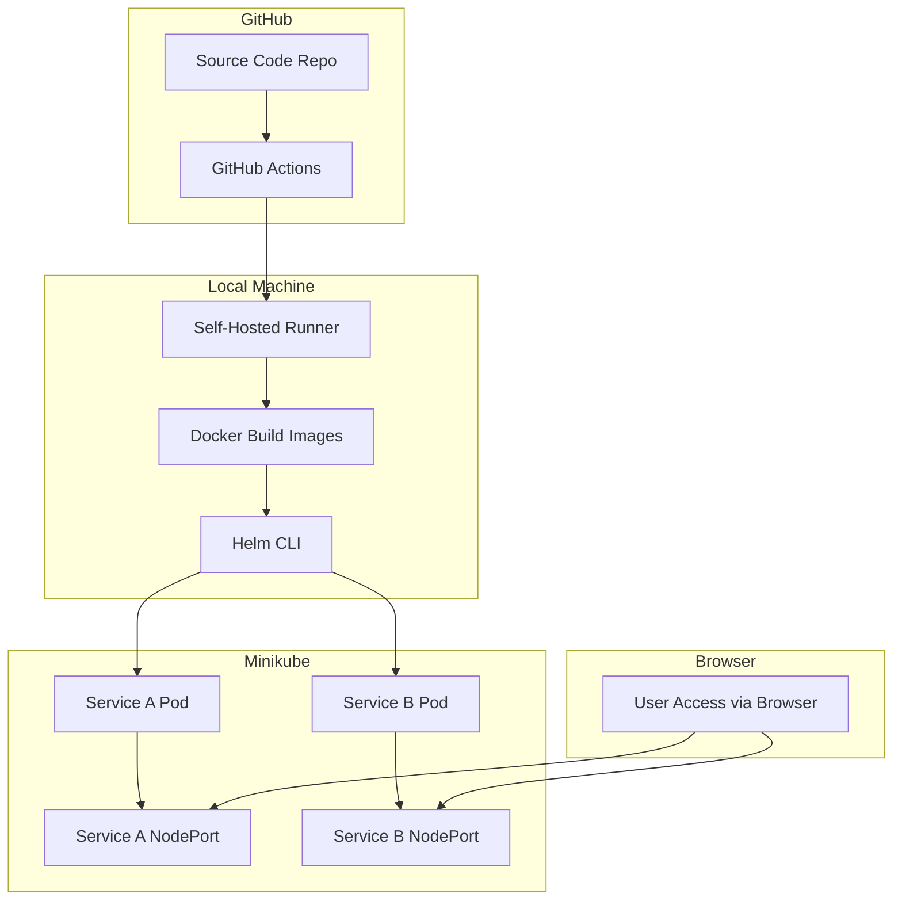
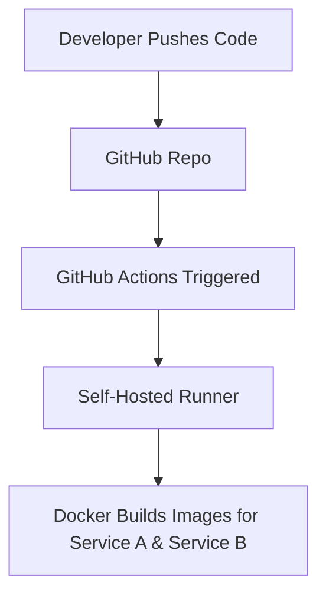
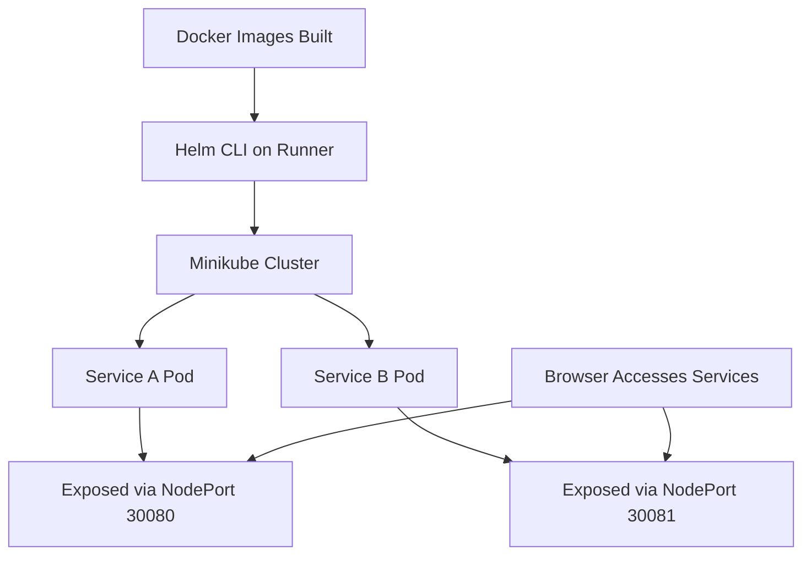

To prepare your full **LinkedIn post**, `README.md`, and any other supporting files (like architecture diagrams, Helm chart templates, etc.), I’ll give you:

---

### ✅ What You'll Get:

1. **`README.md`** — Polished, recruiter-ready
2. **LinkedIn Post Content** — Short and impactful
3. **Project File Suggestions** — List of what to include in your repo
4. **Bonus Assets** — Optional diagram (you can use or skip)

---

## ✅ Final `README.md` for GitHub

Here's the full README content (you can copy this into your `README.md` file in your repo):

---

```markdown
# 🚀 DevOps Microservices CI/CD Project with Kubernetes, Helm & GitHub Actions

This is a real-world DevOps portfolio project demonstrating a full CI/CD pipeline for containerized microservices deployed to a local Kubernetes cluster using Helm and GitHub Actions.

---

## 🔧 Tech Stack

| Layer              | Tools Used                                  |
|-------------------|----------------------------------------------|
| Microservices      | Node.js + Express                            |
| Containerization   | Docker                                       |
| Kubernetes         | Minikube (Local K8s Cluster)                 |
| CI/CD              | GitHub Actions + Self-Hosted Runner          |
| Package Manager    | Helm                                         |
| GitOps             | GitHub                                       |

---

## 📦 Microservices Overview

### 🟢 Service A
- URL: `/`
- Returns a styled HTML page with hostname and time
- Exposed via NodePort

### 🔵 Service B
- Similar to Service A
- URL: `/`

---

## ⚙️ Project Architecture

```

Developer → GitHub → GitHub Actions
↓
Build Docker Images
↓
Deploy via Helm to Minikube (Local K8s)
↓
Services accessible via browser

````

> ⚡ CI/CD powered by a **self-hosted GitHub Actions runner** that can directly access Minikube!

---

## 🔁 CI/CD Workflow

1. **Code Commit**
2. **CI:** GitHub Actions build Docker image
3. **CD:** Helm installs/updates the services on local Kubernetes
4. **Validation:** Automatic pod rollout and health checks

---

## 🛠️ Setup Instructions

### 🐳 1. Build Docker Images Locally

```bash
docker build -t service-a:latest ./app/service-a
docker build -t service-b:latest ./app/service-b
````

### 🎛️ 2. Start Minikube

```bash
minikube start
```

### 📦 3. Deploy with Helm

```bash
helm upgrade --install service-a helm/charts/service-a
helm upgrade --install service-b helm/charts/service-b
```

### 🌐 4. Access Services

```bash
minikube service service-a
minikube service service-b
```

OR use the IP directly:

```bash
http://$(minikube ip):30080
http://$(minikube ip):30081
```

---

## 🤖 GitHub Actions: Self-Hosted Runner Setup

> This lets GitHub Actions control your local Minikube cluster!

```bash
mkdir actions-runner && cd actions-runner
# Download correct version
curl -o actions-runner.tar.gz -L https://github.com/actions/runner/releases/download/v2.328.0/actions-runner-linux-x64-2.328.0.tar.gz
tar xzf actions-runner.tar.gz

# Get token from GitHub → Settings → Actions → Runners → Add Runner
./config.sh --url https://github.com/YOUR_USERNAME/YOUR_REPO --token <token>
./run
```

Once configured, GitHub Actions will trigger `helm upgrade` from your local machine!

---

## 📂 Repo Structure

```bash
.
├── app/
│   ├── service-a/
│   │   └── index.js
│   └── service-b/
│       └── index.js
├── helm/
│   └── charts/
│       ├── service-a/
│       └── service-b/
├── .github/
│   └── workflows/
│       └── ci.yml
├── Dockerfile (in each service folder)
└── README.md
```

---

## 🌟 Highlights for Recruiters

* ✅ GitHub Actions + Self-Hosted Runner CI/CD
* ✅ Helm-based K8s deployment
* ✅ Custom HTML web UI in each service
* ✅ Local cluster but production-like flow
* ✅ Shows real DevOps problem-solving

---

## 🙌 Author

**Mahadev Metre**
DevOps Engineer | CI/CD | Kubernetes | GitHub Actions
[LinkedIn](https://www.linkedin.com/in/YOUR-LINKEDIN)

---

```

---

## ✍️ Suggested LinkedIn Post

Here’s a short, strong LinkedIn post:

---

🚀 **Just Finished a Hands-On DevOps CI/CD Project!**

🔧 Built a full microservices pipeline with:

✅ Docker  
✅ Kubernetes (Minikube)  
✅ Helm  
✅ GitHub Actions (with self-hosted runner!)  
✅ Automated deployments  
✅ Real web apps deployed via CI/CD

📸 Deployed apps now serve styled web pages with real-time status and container info — great for demos or recruiter showcases.

🔗 Repo: [GitHub Repo Link]  
🌐 Try it locally or just check the code!

I’m a 2Y DevOps engineer constantly building real-world workflows to grow. Let me know what you think!

#devops #cicd #githubactions #kubernetes #helm #portfolio

---

## 📎 Optional Extra Files to Include

If you want to polish it even more:

- `architecture-diagram.png` (I can generate one if you want)
- `screenshots/` folder showing:
  - Pods running
  - Web UI of both services
  - GitHub Actions run
- `.dockerignore` for each service
- `Makefile` (optional for local dev commands)

---

Let me know if you want:

- 🧠 An architecture diagram image
- 📁 Example screenshot bundle
- 🐳 A `Makefile` to simplify dev commands

I'll give you those too. Ready to publish!
```





 <summary>📦 Click to Expand - Mermaid Diagrams</summary>


## ⚙️ CI Pipeline



## 🚀 CD Pipeline



